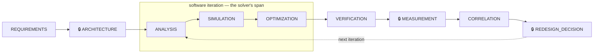

# Principal RF Engineer Agent

> An AI-assisted RF/microwave engineering workstation that is built around **evidence and tools**, not around asking a language model to "know RF."

[](https://www.python.org/)
[](pyproject.toml)
[](docs/FREE_AND_OPEN_SOURCE_TOOLING.md)
[](#choose-an-llm-provider)
[](#licensing)

Every number this system produces is either computed by a deterministic tool, produced by
a named solver, or read out of a cited source — and it is **tagged with how it was
obtained**. The language model reads requirements, proposes candidates and drives tools;
it never does the arithmetic, and it never supplies a confidence in place of a computed
one.

The whole free/open-source stack reaches a working, verified design — no paid API key and
no paid EDA license anywhere on that path. Physical measurement, where a design needs it,
happens on someone else's bench and comes back as a file: this system drives no
instruments at any point.

---

## Contents

- [The core idea](#the-core-idea)
- [Quick start](#quick-start)
- [How it works](#how-it-works)
- [The agent surface](#the-agent-surface)
- [Installation](#installation)
- [Continuous integration](#continuous-integration)
- [Development order](#development-order)
- [Planning in progress](#planning-in-progress)
- [Documentation map](#documentation-map)
- [Licensing](#licensing)
- [Working in this repo](#working-in-this-repo)

---

## The core idea

Two rules shape every design decision in this codebase.

### 1. Evidence is ranked, and the ranking is explicit

Strongest first. **Higher wins when evidence conflicts**, and the ranking is not merely
advisory: each ingested document carries an *authority rank* defaulted from its source
type, and knowledge retrieval sorts by that rank *before* match score.

| Rank | Evidence |
|:--:|---|
| 1 | Measured |
| 2 | Validated simulation |
| 3 | Deterministic calculation |
| 4 | Manufacturer specification/model |
| 5 | Authoritative technical reference |
| 6 | Internal engineering history |
| 7 | General web material |
| 8 | LLM inference |

### 2. Every significant result carries its provenance

`MEASURED` · `SIMULATED` · `CALCULATED` · `MANUFACTURER-SPECIFIED` ·
`LITERATURE-SUPPORTED` · `INFERRED` · `ASSUMED` · `UNKNOWN`

This is the **only** confidence vocabulary in the project. There is no parallel
"provisional" / "beta" / "draft" tag, and no path by which an LLM-estimated confidence
becomes a `CALCULATED` one ([ADR-0003][adr3], [ADR-0014][adr14]).

> [!NOTE]
> `CONTEXT.md` is the project's glossary — what each domain term means, and which
> synonyms to avoid. Read it before adding vocabulary. It holds no implementation
> status: what is built is described here, and open work lives in GitHub Issues.

---

## Quick start

**Prerequisites:** Python 3.12+, Docker with the Compose plugin, and [uv][uv].

```bash
# 1. Configure. The defaults need no API key: LLM_PROVIDER=local.
cp .env.example .env

# 2. Bring up Postgres + the local LLM/embedding server.
docker compose up -d

# 3. Pull the two default local models (skip if using a hosted provider).
docker compose exec ollama ollama pull gpt-oss:20b   # LOCAL_AGENT_MODEL
docker compose exec ollama ollama pull bge-m3        # LOCAL_EMBEDDING_MODEL

# 4. Install and verify.
uv sync
uv run pytest

# 5. Ask it something.
uv run python -m agent.main "Analyze the requirements for a 2.45 GHz PCB antenna."
```

**What you should see.** Not an answer. On a requirement this underspecified the agent is
expected to name what is *missing* — dielectric constant, substrate thickness, ground-plane
dimensions, required gain and bandwidth — compute only what is actually determined
(λ₀ ≈ 122.36 mm), and produce a verification matrix rather than an invented stackup.
`examples/first_engineering_task.md` is that expected behaviour, written down.

> [!TIP]
> Using a hosted provider instead? `docker compose up -d postgres` is enough, the model
> pulls are unnecessary, and you set `LLM_PROVIDER=openai` (or `anthropic`) plus the
> matching API key in `.env`. See [Choose an LLM provider](#choose-an-llm-provider).

---

## How it works

The unit of work is a **design loop** — a nine-step state machine
(`orchestration/design_loop.py`) that carries one design from a customer requirement to a
redesign decision, calling into the deterministic tools rather than reimplementing them.



🔒 marks a **gated** step: it cannot advance without a recorded approval receipt
(`orchestration/approval.py`). The three gates are exactly the transitions whose result is
a human judgment call rather than a `CALCULATED`/`SIMULATED` number.

**Granting a gate — why a loop can get stuck at ARCHITECTURE.** No agent tool or MCP tool
can grant one of these receipts; that is deliberate (`orchestration/approval.py`,
`designs/release_approval.py`). A human with local access to the machine running the live
session grants or refuses one by running the CLI directly, at a terminal:

```bash
uv run python -m orchestration.approval_cli <subcommand> ...
```

`list` / `show <id>` / `submit --state <loop-state.json> --step-input <step-input.json>
--submitted-by <name>` / `approve <id> --approved-by <name>` / `refuse <id> --approved-by
<name>` decide a loop-step gate (ARCHITECTURE, MEASUREMENT, REDESIGN_DECISION); the
`-release` siblings — `list-release` / `show-release <id>` / `submit-release --design
<design.json> --submitted-by <name>` / `approve-release <id> --approved-by <name>` /
`refuse-release <id> --approved-by <name>` — decide a design's own `RELEASED` gate (see
"States" in `docs/OPERATIONS.md`). Without a human running this CLI, every gated step —
and a design's own move to `RELEASED` — simply keeps refusing.

### Around the loop

| Piece | What it does | Why it is shaped that way |
|---|---|---|
| **Requirement targets**<br>`designs/requirement_targets.py` | Turns prose — *"needs to work at 2.4 GHz without losing gain"* — into a value / comparator / unit / tolerance, stored beside the original prose. | Tagged `ASSUMED`, and it **stays** `ASSUMED` even after a human confirms it: a confirmed reading of prose is still a reading of prose. |
| **Success score**<br>`designs/success_score.py` | Measures how close a step's numeric result sits to that target. | Plain floating-point comparison, `CALCULATED` provenance. `ARCHITECTURE` and `REDESIGN_DECISION` get no score — they are judgment, not measurement. |
| **Candidate solver**<br>`orchestration/solver.py` | Drives batches of proposed parameter sets through the **ungated** `ANALYSIS`→`SIMULATION`→`OPTIMIZATION` span, scoring each. | Stops on target satisfaction, a score plateau, its evaluation budget, or a gate — and **says which**, so you know when software has run out and a lab trip is the honest next move. It never modifies the loop, forges a receipt, or drives `CORRELATION` ([ADR-0014][adr14]). |
| **Lab test plan**<br>`orchestration/lab_test_plan.py` | Compiles, *before* the trip, what to measure per requirement, by what method, and what this iteration already predicts. | The bench is a rare, deliberate confirmation — not the iteration mechanism. A requirement nothing on hand can confirm is flagged in the driveway, not at the bench. |
| **External measurement**<br>`measurement/external.py` | Accepts a Touchstone (`.sNp`) file measured on independent equipment and brought back. | There is no instrument control at all. A file you hand back earns full `MEASURED` provenance; a lab report may ride along as unparsed audit context ([ADR-0012][adr12], [ADR-0013][adr13]). |

---

## The agent surface

Every capability is registered over **MCP** (`mcp_server/server.py`, stdio). A subset is also
wrapped as directly-attached **agent tools** in `agent/main.py` — the ones the microwave,
antenna and test roles need, because those roles run external solvers and a solver call over
the MCP stdio transport hangs on native Windows ([#372][i372]). Both surfaces are governed by
`policies/tool_policy.yaml`.

The work splits across six roles, each scoped to only the tools its discipline needs. The
principal, systems and verification roles are built in `agent/mcp_roles.py` and reach every
tool they hold over MCP; the other three are built in `agent/main.py`:

| Role | Focus |
|---|---|
| **Principal RF Engineer** | Routes to the specialist whose domain fits the question; the only role holding the design-loop tools |
| **Systems RF Engineer** | Link budgets, cascaded gain/noise figure, electrical-size bookkeeping, knowledge-base ingestion |
| **Microwave Engineer** | Match, noise figure, S/Z/Y/ABCD conversions, stability circles, impedance matching |
| **Antenna Engineer** | Electrical size, port match, patch synthesis, conformal/curvature corrections |
| **Test Engineer** | Touchstone analysis — interpolation, de-embedding, cascading, measured-vs-predicted comparison |
| **Verification Engineer** | Provenance auditing, per-field component specs, prior design and decision records |

### Repository layout

```text
.
├── agent/            # role-scoped agents + principal-to-specialist routing
├── mcp_server/       # the same tool surface over MCP (stdio)
├── rf_tools/         # deterministic calculations, Touchstone, correlation
├── designs/          # design records, requirement targets, success score
├── orchestration/    # design loop, approval gates, solver, lab test plan
├── simulation/       # EM/circuit solver adapters
├── geometry/         # unit-cell arrays, curved/conformal host surfaces
├── optimization/     # sweeps, grid/Bayesian search, GA, gradient
├── measurement/      # externally-obtained results only (no instrument control)
├── verification/     # verification matrix, retrieval-quality gate, simulator reference cases
├── knowledge/        # ingestion, embedding, extraction, component lookup
├── db/               # Postgres schema + init, and the shared connection pool
├── policies/         # tool_policy.yaml (the permission model)
├── prompts/          # principal-engineer system prompt
├── tests/
├── examples/
├── docs/             # ADRs, build plan, roadmap, security, license matrix
├── CONTEXT.md        # the domain glossary (terms only, no status)
├── AGENTS.md         # repo conventions for AI coding agents
├── docker-compose.yml
├── pyproject.toml
└── .env.example
```

---

## Installation

### System requirements

| | Minimum | Recommended |
|---|---|---|
| OS | — | Ubuntu 24.04 LTS |
| Python | 3.12 | 3.12+ |
| RAM | 16 GB | 32–64 GB |
| Disk | — | 1 TB SSD |
| Also | Git, Docker + Compose plugin | NVIDIA GPU for the local LLM |

### Choose an LLM provider

`LLM_PROVIDER` decides who answers the agent's own reasoning and tool-calling:

| Value | Cost | Needs |
|---|---|---|
| `local` **(default)** | free | The `ollama` service in `docker-compose.yml`, plus `LOCAL_AGENT_MODEL` |
| `openai` | paid | `OPENAI_API_KEY` |
| `anthropic` | paid | `ANTHROPIC_API_KEY` |
| `runpod` | paid, per-second | `RUNPOD_API_KEY`, `RUNPOD_ENDPOINT_ID`, `RUNPOD_MODEL` — a RunPod Serverless vLLM endpoint you deploy yourself; scales to zero when idle. For a model too large for local GPU VRAM. Hosted cloud API from a data-egress standpoint, same as `openai`/`anthropic` — not covered by ADR-0004's local-only rule for SENSITIVE/RESTRICTED knowledge-base documents (that's a separate config axis, `DEFAULT_LLM_BACKEND`, untouched by this). |

> [!IMPORTANT]
> The **knowledge base** makes a separate backend choice (`DEFAULT_LLM_BACKEND`), driven
> by document sensitivity rather than by cost. `SENSITIVE` and `RESTRICTED` documents
> must use the local backend, with **no fallback** to a hosted API ([ADR-0004][adr4]).

The compose `ollama` service reserves an NVIDIA GPU. On a host with no `nvidia` runtime
registered, remove that `deploy:` block or the service will fail to start; Ollama itself
falls back to CPU on its own.

### Optional: solvers and external tools

None of these are required to install or test the repo — each unlocks the adapter named
beside it. Every tool in the first four groups is free or open source, and that stack
alone reaches a working, verified design.
See [`docs/FREE_AND_OPEN_SOURCE_TOOLING.md`](docs/FREE_AND_OPEN_SOURCE_TOOLING.md) for the
survey behind these choices.

> [!TIP]
> Manual install, tool by tool, is one path — `docker compose build app` (or `docker build
> .`) is the other, and gets you every tool below in one command with no manual step at
> all: `Dockerfile` builds all 13 solvers plus Gmsh, gerbv, FreeCAD, and KiCad into one
> Ubuntu 24.04 image (Linux-only; several of these have no native Windows build at all —
> see the `Dockerfile`'s own header comment for why). Verified 2026-09-04 against a real,
> from-scratch (`--no-cache`) build: every one of the 17 tools below actually runs inside
> the built image, checked live (`ngspice -v`, `kicad-cli version`, `gmsh --version`,
> `gerbv --version`, `FreeCADCmd --version`, `nec2++ -h`, `ElmerSolver -v`, `qucsator_rf
> --version`, `Xyce -v`, `palace --help`, `python -m gprMax --help`, `python -c "import
> meep"`, and `openEMS --version`, plus `OpenParEM3D.bin`'s presence/permissions) — not
> just a green build.

<details>
<summary><b>Full-wave EM solvers</b> — NEC2++, openEMS, OpenParEM, Elmer, Palace, gprMax, MEEP</summary>

<br>

- **NEC2++** — method-of-moments wire modelling. `simulation/nec2pp.py`
- **openEMS** — FDTD. `simulation/openems.py`
- **CSXCAD** — openEMS's own geometry/materials library. No PyPI package: build from
  source or install a platform-specific pre-built wheel, see
  [docs.openems.de/python/install.html](https://docs.openems.de/python/install.html).
  Separately, `pip install '.[geometry]'` installs **gdstk**, this repo's other
  geometry-generation dependency, which *is* a regular PyPI package — see
  `geometry/unit_cell.py` and `pyproject.toml`'s `geometry` extra.
- **OpenParEM** (OpenParEM2D/3D) — full-wave FEM for antenna far-field gain, directivity
  and efficiency. Source or pre-compiled binary only, not pip-installable.
  `simulation/openparem.py`
- **Elmer FEM** (ElmerSolver, VectorHelmholtz module) + **Gmsh** + **ElmerGrid** — general
  multiphysics EM cross-check. `simulation/elmer.py`
- **Palace** ([awslabs/palace](https://github.com/awslabs/palace)) — full-wave FEM with
  native Floquet/periodic-port boundaries, for periodic metamaterial unit cells. Manual
  source/binary install, no pyproject extra. `simulation/palace.py`. The adapter has
  been run end to end against a real `palace` binary and reproduces Palace's own
  published dielectric-grating results to within 0.056 dB — see
  [`docs/palace-floquet-validation.md`](docs/palace-floquet-validation.md), which also
  records how Palace was built.
- **gprMax** — ground-coupled / lossy-half-space FDTD. Needs conda plus a C compiler with
  OpenMP, then `python setup.py build && python setup.py install`; not pip-installable.
  See `simulation/gprmax.py`'s module docstring.
- **MEEP** — FDTD, driven as a Python library (`import meep`). A second, independent
  full-wave solver, so a design decision can be cross-checked against openEMS rather than
  resting on one solver alone. No PyPI wheel: install via conda-forge
  (`conda create -n mp -c conda-forge pymeep`). No native Windows support — use WSL.
  `simulation/meep.py`

</details>

<details>
<summary><b>Circuit solvers</b> — Qucs-S, ngspice, Xyce, LTspice</summary>

<br>

- **Qucs-S / qucsator_rf** — native multi-port S-parameter simulation. Manual build from
  source, see [ra3xdh/qucsator_rf](https://github.com/ra3xdh/qucsator_rf). Note the CLI
  binary `simulation/qucs.py` shells out to is named `qucsator_rf`, **not** the bare
  `qucsator` its upstream project is colloquially called.
- **ngspice** — `simulation/ngspice.py`. Verified against a real ngspice
  install 2026-09-04 (RC-filter `.AC` sweep; see that module's docstring).
  Linux: `apt install ngspice` — the plain default binary name already
  matches, no config needed. Windows: no installer exists; run
  `pwsh scripts/install_ngspice_windows.ps1` (downloads/checksums/extracts
  a portable build, no Administrator rights required) and set
  `NGSPICE_BIN` to the path it prints.
- **Xyce** — `simulation/xyce.py`
- **LTspice** — batch/CLI mode, via the optional extra: `uv sync --extra ltspice`.
  `simulation/ltspice.py`

These three are the free/OSS answer to Keysight ADS, for which no adapter exists here.

</details>

<details>
<summary><b>Geometry and PCB</b> — KiCad, gerber2ems, gerbv, FreeCAD</summary>

<br>

- **KiCad** (application + `kicad-cli`) — PCB geometry export via kicad-python's IPC API
  ([#65](https://github.com/parthalon025/Principle_RF_Engineer_Agent/issues/65))
- **gerber2ems** — PCB trace signal-integrity front end for openEMS. Not on PyPI; install
  from [antmicro/gerber2ems](https://github.com/antmicro/gerber2ems).
  `simulation/kicad_gerber2ems.py`
- **gerbv** — the Gerber rasterizer gerber2ems shells out to internally
- **FreeCAD** (headless `FreeCADCmd`) — curved/conformal host-surface geometry mapping
  ([#66](https://github.com/parthalon025/Principle_RF_Engineer_Agent/issues/66)). Not
  pip-installable: install from
  [freecad.org/downloads.php](https://www.freecad.org/downloads.php) or your package
  manager (`apt install freecad`), then confirm `FreeCADCmd` is on `PATH` or point the
  `FREECAD_BIN` env var at it. `geometry/freecad_curved.py`

</details>

<details>
<summary><b>Component data</b> — Digi-Key, Mouser, Nexar credentials</summary>

<br>

Free developer accounts, no purchase required
([#67](https://github.com/parthalon025/Principle_RF_Engineer_Agent/issues/67)). Set in
`.env` — see `.env.example`. All three clients are implemented and tested against fakes,
but none has been exercised against the live API here (no credential, no outbound
network), so treat the first credentialed run as unproven:

`DIGIKEY_CLIENT_ID` / `DIGIKEY_CLIENT_SECRET` · `MOUSER_API_KEY` ·
`NEXAR_CLIENT_ID` / `NEXAR_CLIENT_SECRET`

> [!WARNING]
> The three `lookup_*_component` tools additionally require
> `ALLOW_EXTERNAL_NETWORK_TOOLS=true` — they place a real, credentialed call to a third
> party. See `policies/tool_policy.yaml`'s `approval_self_gated` category.

</details>

<details>
<summary><b>Commercial — off the default path</b></summary>

<br>

- **Ansys AEDT/HFSS + PyAEDT** — requires a paid AEDT license. `simulation/hfss.py` is a
  real, working `HfssSimulator` adapter for teams that already hold one, confined to a
  controlled licensed workstation (`check_hfss_workstation_confinement`). It is
  deliberately **not** part of the path to a working, verified design ([ADR-0012][adr12]).
  Install with `uv sync --extra hfss`. Note that the adapter is written and
  citation-sourced against the real PyAEDT API but has **never been exercised against a
  real HFSS install** — no unlicensed environment can run it, so treat the first licensed
  run as unproven.
- **Keysight ADS** — no adapter exists in this repo. Use the circuit solvers above.

</details>

---

## Continuous integration

[`.github/workflows/ci.yml`](.github/workflows/ci.yml) runs on every push to `main` and
every pull request against it, as two separate jobs so a lint failure and a test failure
are distinguishable at a glance:

| Job | Runs | Needs |
|---|---|---|
| **ruff** | `ruff check` and `ruff format --check` | Nothing — installs 8 dev packages, not the project's 169 |
| **pytest** | The full suite | A `pgvector/pgvector:pg17` service container with `db/schema.sql` applied via `db/apply_schema.py` |

CI holds **no LLM credential** (no `OPENAI_API_KEY`, no `ANTHROPIC_API_KEY`, no
`LOCAL_LLM_BASE_URL`) and installs none of the optional extras (`hfss`, `measurement`,
`geometry`, `ltspice`, `kicad`). No test needs a live model or embedding backend to pass;
the extras' tests skip themselves with a stated reason, and `pytest -rs` prints every skip
reason in the run log — so nothing is silently unverified.

> [!WARNING]
> **The `ruff format --check` step is currently expected to fail**, on `main` and on every
> branch off it. The repo carries pre-existing formatting drift — 55 files at the time of
> writing — and the fix is [issue #99][i99]'s repo-wide `ruff format` pass, landing as its
> own commit. It is not a signal about the branch under test, and reformatting files
> incidentally in an unrelated PR is not the fix. `ruff check` passes.

---

## Development order

1. Deterministic calculations
2. Touchstone analysis
3. Knowledge database
4. MCP tools
5. Principal-agent orchestration
6. NEC2++ / openEMS and the rest of the free/OSS solver stack
7. Optimization
8. Externally-obtained measurement ingestion
9. Simulation/measurement correlation
10. Controlled optimization and the candidate solver

No step above requires a paid license. Step 8 ingests measurements taken elsewhere — this
system drives no instruments at any point. HFSS/PyAEDT sits outside the sequence entirely,
for teams that already hold an AEDT license.

> [!CAUTION]
> Do not give the agent unrestricted control of laboratory instruments or production
> release. Physical-instrument control is not merely disabled here — it was **deleted**
> ([ADR-0012][adr12]). Re-entering that scope means rebuilding it deliberately against
> whatever this system looks like then, not flipping a flag.

Both planning docs describe an *intended* sequence, and the repo has grown past both —
read them as a plan, not as a record of what is in the tree. This section and the rest of
this README are the status source; open work is in GitHub Issues.

See [`docs/BUILD_PLAN.md`](docs/BUILD_PLAN.md) and [`docs/ROADMAP.md`](docs/ROADMAP.md) for
the intended sequence, and [`docs/SECURITY.md`](docs/SECURITY.md) plus
`policies/tool_policy.yaml` for the tool-permission model.

---

## Planning in progress

Work too large for one session is planned as a **Wayfinder map**: a single issue labelled
`wayfinder:map` holding the destination, the standing constraints and the decisions made so
far, with child issues as decision tickets. The map is an *index* — each decision lives in
its own ticket, never restated on the map.

**Active map:** [Printed metamaterial EM skin design loop
#104](https://github.com/parthalon025/Principle_RF_Engineer_Agent/issues/104)

Its destination is a handoff-ready spec for a design loop that takes a prose customer
requirement and returns scored, fabricable printed-metamaterial candidates — with material
and substrate as *searched variables*, and unit-cell periodicity (not patch length) as the
degree of freedom. It is **plan-only**: its tickets produce decisions, and implementation
lands separately as `ready-for-agent` issues.

Two of its settled constraints govern how anything from that effort should be read:

- **No VNA and no measurement fixture are available.** The provenance ceiling for RF
  response is `SIMULATED`, so a reproduction verdict reads *"agrees with our reading of
  the published figure"* — never *"agrees with the patent."* Geometry, thickness and sheet
  resistance **are** measurable, and they are the simulation's inputs.
- **Threshold prunes, objective scores.** A requirement carries a minimum acceptable value
  and, optionally, a desired one. Hardness is asserted, never inferred, and preference
  enters as an explicitly recorded constraint — never as scoring bias.

The map's fifteen supporting research documents are on `main`, under `docs/` — substrate
shortlists, MXene printability, the Rozanov thickness/bandwidth bound, element-library
prior art, the superposition coupling error bar, and the rest.

> [!TIP]
> **Start at [`docs/RUNNING-LISTS.md`](docs/RUNNING-LISTS.md)** — stranded sources, open
> questions for the patent's inventors, corrections, and the ranked unknowns. It is the
> index to the other fourteen. The map's own body lists which of its earlier claims those
> documents have since overturned; where a research document and the handoff disagree,
> the research document wins.

---

## Documentation map

| Document | Holds |
|---|---|
| [`CONTEXT.md`](CONTEXT.md) | The domain glossary — every project term, and the synonyms to avoid |
| [`docs/adr/`](docs/adr/) | Architecture decision records — the *why* behind every constraint above |
| [`docs/BUILD_PLAN.md`](docs/BUILD_PLAN.md) | The twelve-phase build sequence |
| [`docs/ROADMAP.md`](docs/ROADMAP.md) | Milestones 0.1 → 1.0 |
| [`docs/SECURITY.md`](docs/SECURITY.md) | Data-sensitivity and tool-permission model |
| [`docs/OPERATIONS.md`](docs/OPERATIONS.md) | Design lifecycle and operational conventions |
| [`docs/LICENSE_MATRIX.md`](docs/LICENSE_MATRIX.md) | Full upstream-license inventory |
| [`docs/FREE_AND_OPEN_SOURCE_TOOLING.md`](docs/FREE_AND_OPEN_SOURCE_TOOLING.md) | The free/OSS survey behind the solver choices |
| [`docs/tools/`](docs/tools/README.md) | Per-tool capability research for every external simulator, geometry tool, component-sourcing API, and knowledge-ingestion source this repo wires up — what each can do beyond what its adapter uses today |
| [`docs/KNOWLEDGE_PIPELINE_EXTERNAL_REVIEW.md`](docs/KNOWLEDGE_PIPELINE_EXTERNAL_REVIEW.md) | Gap analysis of the knowledge pipeline (embedding-version tracking, chunk dedup, retrieval feedback) |
| [`verification/README.md`](verification/README.md) | The verification matrix, plus the retrieval-quality gate and simulator reference cases |
| [`docs/literature-validation-cases.md`](docs/literature-validation-cases.md) | Four published metasurfaces reconstructed and scored against their authors' own measurements — one executed (and failing informatively), three blocked on named missing information, and the scope limits that would apply even if all four passed |
| [`AGENTS.md`](AGENTS.md) / [`docs/agents/`](docs/agents/) | Repo conventions for AI coding agents |

---

## Licensing

Upstream licenses must be preserved and tracked. **Internal use does not eliminate license
obligations.**

| Component | License |
|---|---|
| OpenAI Agents SDK | MIT |
| MCP Python SDK | MIT |
| scikit-rf | BSD-3-Clause |
| openEMS | GPLv3 |
| CSXCAD | LGPLv3 — separate from openEMS's own GPLv3 |
| gdstk | Boost Software License 1.0 (BSL-1.0) |
| NEC2++ | GPL |
| OpenParEM | GPL-3.0-or-later |
| Qucs-S / qucsator_rf | GPL-2.0-or-later |
| Elmer | LGPL-2.1 (ElmerSolver core, incl. VectorHelmholtz); GPL-2.0 (ElmerGUI/ElmerGrid/ElmerParam) |
| Gmsh | GPL-2.0-or-later |
| ngspice | New (3-clause) BSD core, plus per-subtree LGPL / LGPLv2.1 / Public-Domain / custom-academic components |
| Xyce | GPL-3.0 |
| Palace | Apache-2.0 |
| gprMax | GPLv3-or-later |
| h5py | BSD-3-Clause — reads gprMax's own `.out` HDF5 result format |
| MEEP | GPLv2 |
| PyAEDT | MIT — but requires a legally licensed AEDT installation |
| KiCad (application / kicad-cli) | GPL-3.0-or-later |
| kicad-python | MIT |
| gerber2ems | Apache-2.0 |
| gerbv | GPL-2.0 |
| FreeCAD | LGPL-2.1-or-later |
| Ollama | MIT — the default local LLM/embedding server. Model weights are separate: `gpt-oss:20b` Apache-2.0, `bge-m3` MIT |
| Digi-Key Product Information API v4 · Mouser Search API · Nexar API (Octopart data) | Free developer tiers under **proprietary API terms** — not OSI licenses |
| PostgreSQL | PostgreSQL License |
| pgvector | Permissive PostgreSQL-style license |

Technical books, papers, standards, datasheets and internal documents carry rights
**separate** from software licenses.
See [`docs/LICENSE_MATRIX.md`](docs/LICENSE_MATRIX.md) for the full inventory and the
primary-source verification behind each row.

> [!NOTE]
> Ollama's MIT license is confirmed in
> [`docs/FREE_AND_OPEN_SOURCE_TOOLING.md`](docs/FREE_AND_OPEN_SOURCE_TOOLING.md) but is not
> yet carried into `docs/LICENSE_MATRIX.md`. This repo itself ships no `LICENSE` file — it
> is internal-use, not published under an open-source license.

---

## Working in this repo

Issues, triage labels, wayfinding and domain-doc conventions for AI coding agents are
documented in [`AGENTS.md`](AGENTS.md) / [`CLAUDE.md`](CLAUDE.md) and
[`docs/agents/`](docs/agents/).

Issues live in [this repo's GitHub Issues][issues], with the label vocabulary
`needs-triage` · `needs-info` · `ready-for-agent` · `ready-for-human` · `wontfix`, and
`wayfinder:map` / `wayfinder:<type>` for planning maps and their tickets.

<!-- link definitions -->
[uv]: https://docs.astral.sh/uv/
[i99]: https://github.com/parthalon025/Principle_RF_Engineer_Agent/issues/99
[i372]: https://github.com/parthalon025/Principle_RF_Engineer_Agent/issues/372
[issues]: https://github.com/parthalon025/Principle_RF_Engineer_Agent/issues
[adr3]: docs/adr/0003-no-review-gate-for-component-extraction.md
[adr4]: docs/adr/0004-self-hosted-backend-for-restricted-data.md
[adr12]: docs/adr/0012-hardware-removed-paid-eda-tooling-stays-out-of-roadmap.md
[adr13]: docs/adr/0013-measurement-step-accepts-only-external-results.md
[adr14]: docs/adr/0014-solver-tool-is-additive-never-bypasses-approval-gates.md
